# Database ER Diagram - DSMS Kenilworth International

**Last Reviewed:** 2025-11-25  
**Source:** `API_DOCUMENTATION.md`

This document captures the inferred data model behind the Drone Services Management System (DSMS) APIs. Use the Mermaid ER diagram below to visualize core entities, lookup tables, and their relationships. Keep this file separate from the API documentation as requested.

## Mermaid ER Diagram

```mermaid
erDiagram
    %% ========= GEOGRAPHY =========
    Groups ||--o{ Plantations : "contains"
    Plantations ||--o{ Regions : "contains"
    Regions ||--o{ Estates : "contains"
    Estates ||--o{ Divisions : "subdivides"
    Divisions ||--o{ Fields : "contains"
    Estates ||--o{ Fields : "direct_fields"

    Groups {
        int id PK
        string name
        string description
        datetime created_at
        datetime updated_at
    }

    Plantations {
        int id PK
        int group_id FK
        string name
        string description
        datetime created_at
        datetime updated_at
    }

    Regions {
        int id PK
        int plantation_id FK
        string name
        string description
        datetime created_at
        datetime updated_at
    }

    Estates {
        int id PK
        int region_id FK
        int plantation_id FK
        string name
        string description
        json profile_data
        datetime created_at
        datetime updated_at
    }

    Divisions {
        int id PK
        int estate_id FK
        string name
        string description
        datetime created_at
        datetime updated_at
    }

    Fields {
        int id PK
        int division_id FK
        int estate_id FK
        string name
        decimal area
        json metadata
        datetime created_at
        datetime updated_at
    }

    %% ========= LOOKUPS =========
    MissionTypes {
        int id PK
        string name
        string description
    }

    CropTypes {
        int id PK
        string name
        string description
    }

    ChemicalTypes {
        int id PK
        string name
        string description
    }

    Sectors {
        int id PK
        string name
        string description
    }

    Stages {
        int id PK
        string name
        string description
    }

    TimeSlots {
        int id PK
        string label
        string description
    }

    RejectReasons {
        int id PK
        string reason
        string description
    }

    FlagReasons {
        int id PK
        string reason
        string description
    }

    PartialCompleteReasons {
        int id PK
        string reason
        string description
        string flag
    }

    %% ========= CORE ENTITIES =========
    Users {
        int id PK
        string mobile_no UK
        string role
        string token
        datetime created_at
        datetime updated_at
    }

    Farmers {
        int id PK
        string name
        string nic UK
        string mobile_no
        string address
        json details
        datetime created_at
        datetime updated_at
    }

    Brokers {
        int id PK
        string name
        string mobile_no
        string nic UK
        string bank
        string branch
        string account
        decimal percentage
        date joined_date
        boolean activated
        datetime created_at
        datetime updated_at
    }

    ASCs {
        int id PK
        string name
        string location
        string contact
        datetime created_at
        datetime updated_at
    }

    %% ========= OPERATIONS =========
    Plans {
        int id PK
        int estate_id FK
        int mission_type_id FK
        int crop_type_id FK
        int chemical_type_id FK
        date planned_date
        decimal area
        string status
        string flag
        string ops_approval
        datetime created_at
        datetime updated_at
    }

    Missions {
        int id PK
        int farmer_id FK
        int asc_id FK
        date requested_date
        date planned_date
        string payment_type
        string status
        text details
        datetime created_at
        datetime updated_at
    }

    Tasks {
        int id PK
        int plan_id FK
        int field_id FK
        int pilot_id FK
        string status
        datetime created_at
        datetime updated_at
    }

    Subtasks {
        int id PK
        int task_id FK
        int pilot_id FK
        string status
        string ops_approval
        datetime created_at
        datetime updated_at
    }

    SubtaskLogs {
        int id PK
        int subtask_id FK
        int reason_id FK
        string status
        text reason_text
        datetime created_at
    }

    DJIRecords {
        int id PK
        int task_id FK
        string file_name
        string file_path
        datetime uploaded_at
    }

    TaskFlags {
        int id PK
        int task_id FK
        int reason_id FK
        text reason_list
        string review_status
        datetime created_at
    }

    %% ========= TEAMS & RESOURCES =========
    Teams {
        int id PK
        string name
        string type
        boolean is_plantation
        datetime created_at
        datetime updated_at
    }

    Pilots {
        int id PK
        string name
        string mobile_no
        string nic
        string role
        boolean is_team_lead
        boolean is_asc
        datetime created_at
        datetime updated_at
    }

    Drones {
        int id PK
        string name
        string model
        string serial_number
        string status
        datetime created_at
        datetime updated_at
    }

    Operators {
        int id PK
        string name
        string mobile_no
        string nic
        datetime created_at
        datetime updated_at
    }

    TeamPilots {
        int id PK
        int team_id FK
        int pilot_id FK
        datetime assigned_at
    }

    TeamDrones {
        int id PK
        int team_id FK
        int drone_id FK
        datetime assigned_at
    }

    PlanTeams {
        int id PK
        int plan_id FK
        int team_id FK
        datetime assigned_at
    }

    MissionTeams {
        int id PK
        int mission_id FK
        int team_id FK
        datetime assigned_at
    }

    PlanOperators {
        int id PK
        int plan_id FK
        int operator_id FK
        datetime assigned_at
    }

    PlanResourceAllocations {
        int id PK
        int plan_id FK
        int team_id FK
        int pilot_id FK
        int drone_id FK
        date allocation_date
        datetime created_at
    }

    MissionResourceAllocations {
        int id PK
        int mission_id FK
        int team_id FK
        int pilot_id FK
        int drone_id FK
        date allocation_date
        datetime created_at
    }

    %% ========= REQUESTS =========
    AdHocRequests {
        int id PK
        int estate_id FK
        int farmer_id FK
        date requested_date
        date planned_date
        string status
        text details
        datetime created_at
        datetime updated_at
    }

    RescheduleRequests {
        int id PK
        int plan_id FK
        date old_date
        date new_date
        string status
        text reason
        datetime created_at
        datetime updated_at
    }

    GroupMissions {
        int id PK
        int group_id FK
        int mission_id FK
        datetime assigned_at
    }

    %% ========= FINANCE =========
    PilotRevenue {
        int id PK
        int pilot_id FK
        date date
        decimal assigned_area
        decimal covered_area
        decimal cancelled_area
        decimal covered_revenue
        int downtime_reason_id FK
        string downtime_approval
        decimal downtime_payment
        decimal total_revenue
        boolean verified
        datetime created_at
        datetime updated_at
    }

    %% ========= ASSETS =========
    Vehicles {
        int id PK
        string name
        string model
        string registration
        string status
        datetime created_at
        datetime updated_at
    }

    Generators {
        int id PK
        string name
        string model
        string serial_number
        string status
        datetime created_at
        datetime updated_at
    }

    Batteries {
        int id PK
        string name
        string model
        string serial_number
        string status
        datetime created_at
        datetime updated_at
    }

    RemoteControls {
        int id PK
        string name
        string model
        string serial_number
        string status
        datetime created_at
        datetime updated_at
    }

    Insurance {
        int id PK
        string type
        string policy_number
        date expiry_date
        text details
        datetime created_at
        datetime updated_at
    }

    %% ========= RELATIONSHIPS =========
    Plans }o--|| Estates : "belongs_to"
    Plans }o--|| MissionTypes : "classified_as"
    Plans }o--|| CropTypes : "targets"
    Plans }o--|| ChemicalTypes : "applies"
    Plans ||--o{ Tasks : "has"
    Fields ||--o{ Tasks : "executed_on"
    Tasks ||--o{ Subtasks : "details"
    Subtasks ||--o{ SubtaskLogs : "logged_by"
    Tasks ||--o{ DJIRecords : "records"
    Tasks ||--o{ TaskFlags : "flagged_by"

    Missions }o--|| Farmers : "requested_by"
    Missions }o--|| ASCs : "handled_by"
    Missions ||--o{ MissionTeams : "assigned_to"
    Missions ||--o{ MissionResourceAllocations : "allocations"

    Teams ||--o{ TeamPilots : "has"
    Teams ||--o{ TeamDrones : "has"
    Teams ||--o{ PlanTeams : "deployed_to_plans"
    Pilots ||--o{ TeamPilots : "member_of"
    Drones ||--o{ TeamDrones : "member_of"

    Plans ||--o{ PlanTeams : "uses_team"
    Plans ||--o{ PlanResourceAllocations : "allocations"
    Plans ||--o{ PlanOperators : "operators"
    Operators ||--o{ PlanOperators : "assigned_to"

    AdHocRequests }o--|| Estates : "for_estate"
    AdHocRequests }o--|| Farmers : "raised_by"
    RescheduleRequests }o--|| Plans : "reschedules"

    Groups ||--o{ GroupMissions : "maps_to"
    Missions ||--o{ GroupMissions : "grouped_as"

    RejectReasons ||--o{ SubtaskLogs : "reference"
    FlagReasons ||--o{ TaskFlags : "reference"
    PartialCompleteReasons ||--o{ PilotRevenue : "downtime_reason"
```

## How to Use

1. Copy the Mermaid block into any Markdown viewer that supports Mermaid (e.g., VS Code, GitLab, GitHub with Mermaid enabled, or https://mermaid.live/).
2. Adjust attribute names or add/remove entities as your physical schema evolves.
3. Keep this file aligned with `API_DOCUMENTATION.md`; when new endpoints introduce data entities, update both the documentation and this ERD.

## Notes & Assumptions

- The ERD is inferred from API contracts; actual database constraints may vary.
- Primary keys (PK), foreign keys (FK), and unique keys (UK) are annotated within each entity.
- JSON/text attributes capture payload-style fields returned by the APIs.
- Some intermediate tables (e.g., resource allocations, team membership) are modeled explicitly to mirror RTK Query services.

